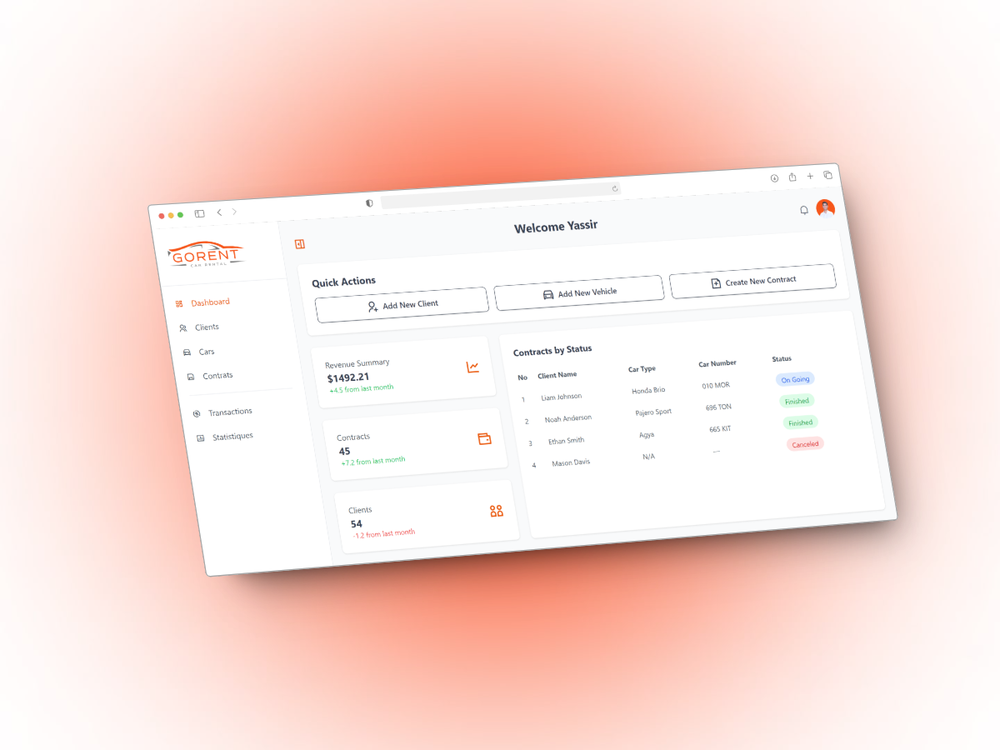

# Car Rental Management Application - Go RENT
 

This project involves developing the backend of a web application for car rental management named GO RENT. The application aims to modernize the handling of data such as clients, cars, and rental contracts while providing a responsive and dynamic user interface for seamless data manipulation and visualization.

## 🛠️ Technologies Used
- **Backend**: PHP
- **Database**: MySQL
- **Frontend**: HTML5, CSS3, Tailwind
- **Version Control**: Git

## 🎯 Project Objectives
1. **Data Modeling and Management**:
   - Design a relational database schema using the Entity-Relationship (E-R) model.
   - Implement SQL scripts to create and manipulate the database.

2. **Backend Features**:
   - Perform CRUD operations (Create, Read, Update, Delete) using PHP scripts.
   - Manage relationships between entities using SQL joins.

3. **Dynamic User Interface**:
   - Develop an ergonomic and responsive interface for CRUD operations.
   - Implement dynamic tables to display data effectively.

## 🚀 Key Features
- **Client Management**:
  - Add, edit, delete, and display client information.

- **Car Management**:
  - Add, edit, delete, and display car details.

- **Rental Contract Management**:
  - Create and manage rental contracts linking clients to cars.
  - Track rental history with statuses.

- **User Interface**:
  - Dynamic tables and ergonomic forms.
  - Mobile-first and responsive design.

## 📋 Installation and Usage

### Prerequisites
- Local server with **PHP** and **MySQL** (e.g., [XAMPP](https://www.apachefriends.org/index.html) or [WAMP](https://www.wampserver.com/)).
- A modern web browser.
- Git for version control.

### Installation Steps
1. **Clone the repository**:
   ```bash
   git clone https://github.com/Yassir-Zbida/Car-Rental.git
   cd car-Rental
